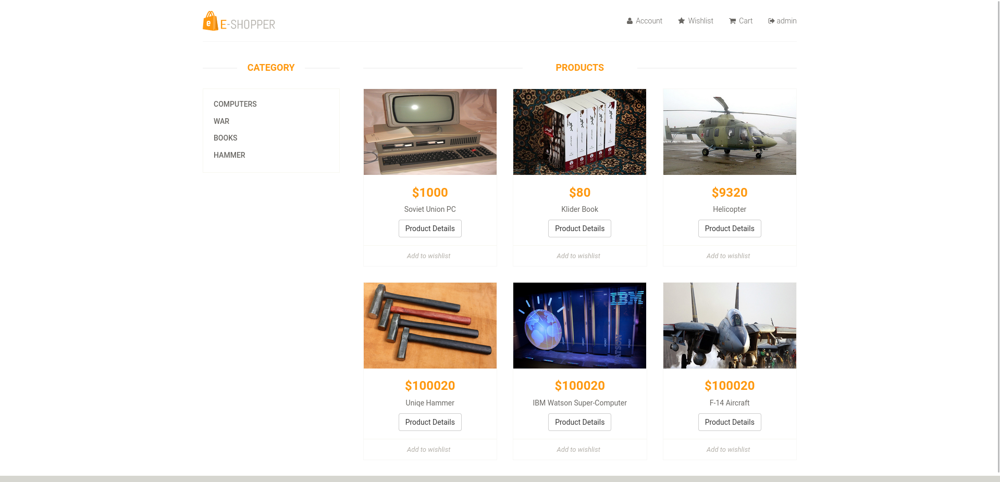
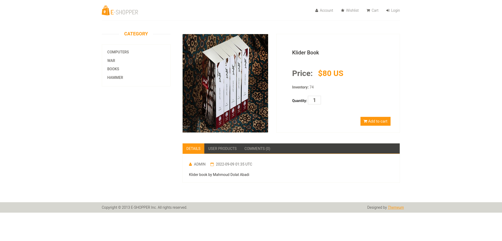
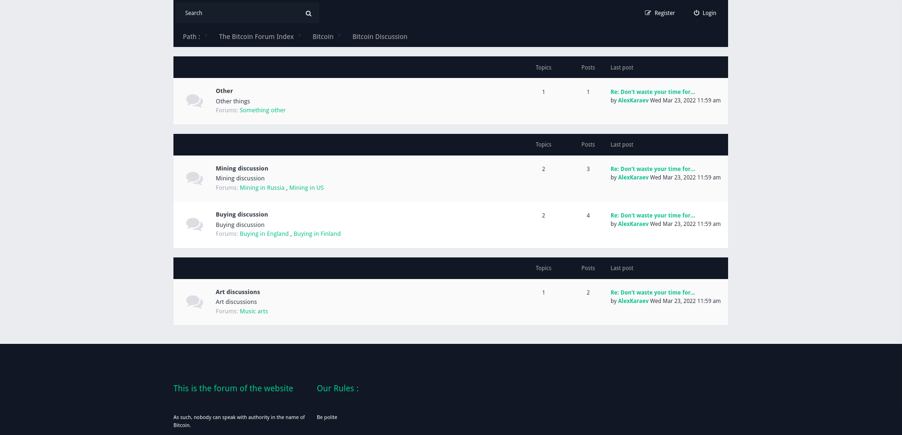
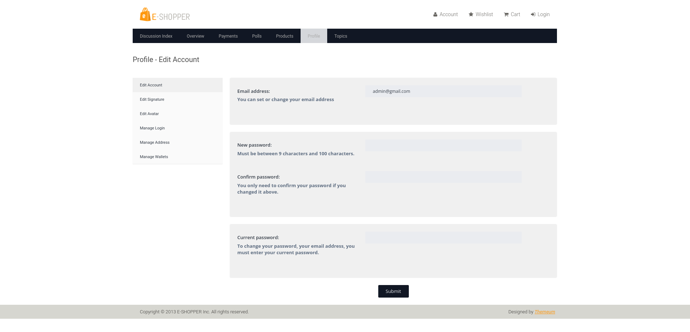

# Freedom For Humans
> *Incomplete*

## Table of Contents
* [General Info](#general-information)
* [Technologies Used](#technologies-used)
* [Screenshot](#screenshot)
* [Test](#test)
* [Project Status](#project-status)
* [Contact](#contact)

## General Information
- This project is a free online marketplace with a forum, You can see this project like eBay(Exaggeration)
- I don't have any credit for the front-end of the website. All credits donates to [phpbb](http://www.phpbb-seo.com/)(forums) and [themezy](https://www.themezy.com/)(surface)
- For now, It's not a complete project, so I won't write long documentation...
- You can take a look at the source code and you'll understand a lot
## Technologies Used
- [Golang v1.8](https://go.dev)
- [MySQL v8.0](https://mysql.com)
- [Gorm v1.23](https://gorm.io)
- [Gin v1.7.7](https://github.com/gin-gonic/gin)
- HTML,CSS

## Screenshot
- Index page

- Product details page

- Discussions page (forum)

- Settings page

## Test
```bash
$ git clone https://github.com/0ne-zero/f4h
$ cd f4h
$ go build && sudo ./f4h
```
- Take a look at [setting file](./config/setting.json) and fill it properly
- Check the source code for more detail

## Project Status
- Project status: _in_progress_
- Usability: ـUnusableـ
## Contact
- Created by [Pouria Khakpour](https://github.com/0ne-zero) - feel free to contact me!
- You can reach me by pouria.khakpour9909@gmail.com
